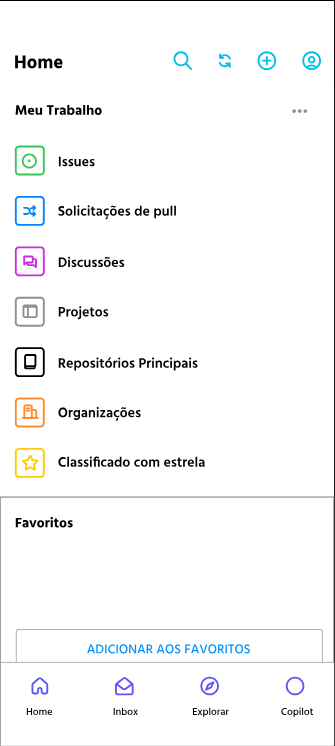
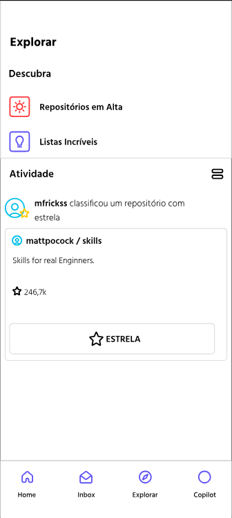
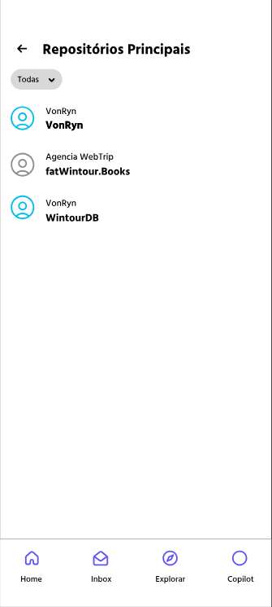
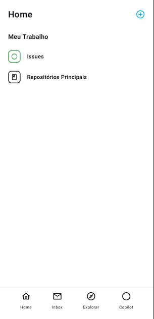

# GitHub UI — Trabalho A2 Segunda entrega

**Autor:** Christian Gustavo Von Ryn  
**Tema:** Copia GitHub

O aplicativo permite criar, listar, editar e excluir repositórios, além de cadastrar, consultar, concluir e excluir issues vinculadas a eles. A aba Explorar apresenta o histórico das alterações nos repositórios.

Este trabalho foi desenvolvido individualmente. A documentação abaixo apresenta a evolução, as decisões de implementação e o funcionamento atual do projeto.

> **Evidência visual pendente:** antes da entrega, inserir nesta documentação o link do vídeo gravado ou os prints reais do aplicativo. Os prints do GitHub usados como referência de layout não substituem imagens deste app funcionando. O roteiro está em [docs/ROTEIRO_VIDEO.md](docs/ROTEIRO_VIDEO.md).

## 1. Como estava no Trabalho 1 e o que mudou?

No primeira entrega, o projeto tinha três telas: Home, Explorar e Repositórios Principais. O foco era reproduzir a aparência do GitHub usando componentes do Compose. Os dados eram fixos e os elementos de navegação ainda não conectava os fluxos de funcionamento.

Agora na segunda entrega, o projeto passou a trabalhar com dados criados durante o uso. A lista de repositórios começa vazia e recebe os itens cadastrados pelo formulário. Cada repositório pode ser aberto, editado e excluído. Também foi acrescentada uma segunda lista, de issues, relacionadas aos repositórios.

Durante a evolução, os layouts foram ajustados usando o próprio GitHub como referência. A Home foi simplificada para manter apenas Issues e Repositórios Principais. O botão + oferece os dois cadastros. Os formulários têm telas próprias, e Explorar passou a mostrar atividades reais do aplicativo, funcionando como um historico de tudo que é realizado.

| Etapa                     | Situação do projeto                                           | Evidência a acrescentar |
|---------------------------|---------------------------------------------------------------| --- |
| Entrega 1                 | Três telas e dados fixos de demonstração                      | Print ou gravação da versão original, se disponível |
| Navegação e estado        | Rotas conectadas e listas atualizadas pelo uso                | Vídeo passando da Home às listas e aos formulários |
| Cadastro e relacionamento | Repositórios e issues criados pelo usuário                    | Vídeo cadastrando os dois tipos de item |
| Detalhes e alterações     | Edição, conclusão, exclusão e histórico                       | Vídeo mostrando os dados antes e depois das ações |
| Ajustes visuais           | Telas simplificadas, retirando o que por hora é desnecessario | Prints da versão final |

### Primeira Entrega

No projeto antigo, as telas abaixo apresentavam a estrutura visual inicial, com foco em ficar o mais fiel possivel ao original.


#### Home antiga

A Home apresentava as todos os icones das telas princial do GitHub.
```markdown

```

#### Explorar antiga

Explorar mostrava as seções de descoberta e atividade com conteúdo fixo de demonstração.

```markdown

```

#### Repositórios Principais antiga

A listagem mostrava repositórios definidos no código, antes de permitir cadastrar, editar e remover itens pelo aplicativo.

```markdown

```

Esses prints documentam o ponto de partida. O vídeo e os prints da seção 6 demonstram a versão atual funcionando.

## 2. Por que essas telas foram escolhidas?

A organização acompanha duas tarefas principais: administrar repositórios e acompanhar suas issues. Os cadastros ficaram separados das listas para manter a interface simples. As telas de detalhes permitem consultar o item escolhido e realizar ações sobre ele.

O projeto tem **dez telas navegáveis**. As duas etapas internas de criação de repositório fazem parte da mesma tela.

| Tela | Função e motivo |
| --- | --- |
| Home | Centraliza os acessos às duas listas e o menu + para criar itens. |
| Explorar | Mostra o histórico de criação, edição e exclusão de repositórios, permitindo acompanhar as mudanças. |
| Repositórios Principais | Apresenta os repositórios cadastrados; tocar em um item abre seus detalhes. |
| Criar repositório | Reúne nome, descrição, visibilidade e linguagem em um fluxo de duas etapas. |
| Editar repositório | Usa o mesmo formulário da criação, preenchido com os dados atuais, com Geral e Configuração e ação Salvar. |
| Detalhes do repositório | Mostra o item escolhido, sua visibilidade, a quantidade de issues abertas e as ações de edição/exclusão. |
| Issues | Exibe todas as issues pela Home ou somente as vinculadas ao repositório acessado. |
| Criar issue | Permite escolher o repositório e informar título e descrição. |
| Editar issue | Usa o formulário da criação para alterar título, descrição e repositório, preservando id e conclusão. |
| Detalhes da issue | Mostra os dados da issue, permite editar, concluir/reabrir, excluir e acessar o repositório relacionado. |

## 3. Como o código foi organizado e por quê?

### Navegação centralizada

O arquivo [AppNavigation.kt](app/src/main/java/com/example/githubui/AppNavigation.kt) concentra o objeto `Rotas`, o `NavHost` e o `Scaffold`. As rotas têm nomes definidos em constantes, evitando repetir textos de navegação em vários lugares.

O `currentBackStackEntryAsState()` acompanha a rota atual para ajustar o cabeçalho e a presença da barra inferior. Os formulários de criação usam seu próprio cabeçalho. Os botões de voltar usam `popBackStack()` e as trocas de tela usam `navigate()`.

A navegação foi centralizada para facilitar a manutenção. As telas recebem funções como `onCriar`, `onDetalhes` e `onVoltar`, enquanto o controle das rotas permanece no arquivo de navegação. As animações de entrada e saída foram desativadas para a troca de telas ser direta.

### Dados compartilhados

O arquivo [GithubViewModel.kt](app/src/main/java/com/example/githubui/GithubViewModel.kt) contém o estado compartilhado e as operações sobre as listas. Isso permite que uma alteração feita no formulário apareça na listagem e nos detalhes.

São utilizadas três `data class`:

- `Repositorio`: id, nome, descrição, linguagem e visibilidade.
- `Issue`: id, id do repositório, título, descrição e situação de conclusão.
- `AtividadeRepositorio`: registro da ação, cópia dos dados do repositório e horário.

As listas são criadas com `mutableStateListOf`. Repositórios e issues são apresentados com `LazyColumn` e `Card`. A atualização do estado faz o Compose atualizar a interface.

Cada item recebe um id crescente. As telas de detalhes recebem esse id pela rota e consultam o objeto correspondente. Isso evita depender da posição do item na lista, que pode mudar após uma exclusão.

Os dados ficam apenas em memória. O ViewModel mantém o estado durante mudanças de configuração, como rotação da tela, mas não existe banco de dados ou armazenamento em arquivo. Encerrar o processo do app perde os cadastros; apenas mandar o app para segundo plano não necessariamente encerra o processo.

### Componentes e prévias

Cada tela fica em um arquivo ou conjunto de telas relacionadas. Componentes comuns, como a barra inferior e as linhas da Home, ficam em [CommonUi.kt](app/src/main/java/com/example/githubui/CommonUi.kt). Os campos sem bordas são compartilhados pelos dois formulários de criação.

As telas possuem `@Preview`. Os dados de exemplo das prévias ficam em [PreviewSupport.kt](app/src/main/java/com/example/githubui/PreviewSupport.kt) e não preenchem as listas quando o aplicativo inicia normalmente.

## 4. Qual é a complexidade extra dos detalhes?

A tela de detalhes do repositório combina informações das duas listas: usa o id do repositório para contar suas issues abertas e abrir somente as issues relacionadas a ele. O botão + também abre o cadastro com esse repositório selecionado.

Por exemplo: um repositório com duas issues abertas mostra o número 2. Ao abrir uma issue e marcá-la como concluída, o número passa para 1 quando voltamos aos detalhes do repositório. A lista ainda mostra a issue concluída, com seu estado atualizado.

Os detalhes também abrem a edição do repositório. A exclusão pede confirmação e remove as issues vinculadas, evitando que existam issues apontando para um repositório que não existe mais.

Essa solução foi escolhida porque representa uma relação natural no tema GitHub: uma issue pertence a um repositório. Assim, os detalhes têm ações e informações relacionadas, além de simplesmente repetir campos de uma lista.

Como complemento, Explorar registra as alterações. Cada atividade guarda uma cópia dos dados naquele momento, por isso uma edição posterior não altera o texto dos registros anteriores e a exclusão não apaga o histórico.

## 5. Quais dificuldades e ajustes apareceram no processo?

Os seguintes pontos foram identificados e tratados durante o desenvolvimento:

| Ponto observado | Solução aplicada |
| --- | --- |
| As telas iniciais eram visuais e usavam dados fixos. | Foram adicionados o NavHost central, os callbacks de navegação e o estado compartilhado no ViewModel. |
| Os primeiros layouts funcionais tinham mais textos e elementos do que as referências do GitHub. | As telas foram ajustadas individualmente a partir de prints: listas simplificadas, formulários separados e cabeçalhos semelhantes às referências. |
| O botão + de Issues parecia ativo, mas ficava desabilitado quando não havia repositórios. | O botão passou a abrir o formulário sempre. A seleção de um repositório válido é verificada ao salvar. |
| A troca de telas apresentava uma animação percebida como demora. | As transições de entrada, saída e retorno do NavHost foram desativadas. |
| Excluir um repositório poderia deixar issues sem referência. | A exclusão também remove as issues que possuem o id daquele repositório. |

## 6. Evidências visuais

**Vídeo de demonstração:** [inserir aqui o link do vídeo após gravar e verificar o acesso].

O [roteiro de gravação](docs/ROTEIRO_VIDEO.md) organiza as cenas, as falas e os dados para demonstração. A gravação deve mostrar as ações e seus resultados, não apenas imagens paradas das telas.

Se optar por prints, salvar as imagens reais em `docs/imagens/` e inserir as imagens no README. A sequência sugerida é:

| Arquivo sugerido | O que comprovar |
| --- | --- |
| `01-home.png` | Home atual e menu + aberto |
| `02-criar-repositorio.png` | Campos preenchidos no cadastro |
| `03-lista-repositorios.png` | Dois repositórios cadastrados |
| `04-detalhes-repositorio.png` | Dados reais e contagem das issues |
| `05-editar-repositorio.png` | Edição do item escolhido |
| `06-criar-issue.png` | Repositório selecionado e campos preenchidos |
| `07-lista-issues.png` | Issues vinculadas ao repositório correto |
| `08-detalhes-issue.png` | Issue concluída e vínculo com o repositório |
| `09-excluir.png` | Confirmação de exclusão |
| `10-historico.png` | Atividades de criação, edição e exclusão |

Depois de salvar cada arquivo, usar o seguinte formato, trocando nome e legenda:

```markdown

```

Não basta deixar a tabela ou o exemplo acima: é necessário inserir as imagens existentes ou substituir o campo do vídeo por um link acessível.

## 7. Como executar

1. Abrir a pasta do projeto no Android Studio.
2. Instalar o Android SDK 37 pelo SDK Manager e aguardar a sincronização do Gradle.
3. Usar um JDK compatível com a configuração do projeto; o arquivo de critérios do daemon solicita JDK 25.
4. Selecionar um emulador ou aparelho com Android 7.0 (API 24) ou superior.
5. Executar o módulo `app`.

Para compilar e rodar os testes unitários no PowerShell, na raiz do projeto:

```powershell
.\gradlew.bat :app:assembleDebug :app:testDebugUnitTest
```

O APK de depuração é gerado em `app/build/outputs/apk/debug/app-debug.apk`.

## 8. Verificações e limites desta versão

A compilação de depuração foi concluída com sucesso durante o desenvolvimento. Os testes específicos em [GithubViewModelTest.kt](app/src/test/java/com/example/githubui/GithubViewModelTest.kt) passaram na execução registrada e cobrem validação, preservação dos ids, vínculo entre as listas, conclusão de issues e histórico. Esses testes não substituem a verificação visual e os cliques no aparelho.

O app é uma simulação local, sem login ou comunicação com a API do GitHub. O usuário exibido é um marcador de interface. Home e Explorar navegam pela barra inferior; Inbox, Copilot e as opções de Descubra permanecem visuais. Estrela e sino têm estado visual local, a bifurcação está desativada e Código não armazena arquivos. A barra inferior é um componente Compose próprio, não o componente Material `NavigationBar`.

## 9. Antes da entrega

- [ ] Inserir o vídeo ou os prints reais do aplicativo funcionando.
- [ ] Revisar o relato com as próprias palavras e completar eventuais experiências pessoais.
- [ ] Confirmar com o professor a entrega individual, pois o enunciado menciona trio.
- [ ] Conferir com o professor a aceitação dos elementos apenas visuais e da barra inferior personalizada, considerando os requisitos de navegação.
- [ ] Testar os fluxos do roteiro no aparelho ou emulador.
- [ ] Publicar em um novo repositório GitHub, conforme o enunciado.
- [ ] Conferir o acesso ao repositório e ao vídeo antes de enviar.

